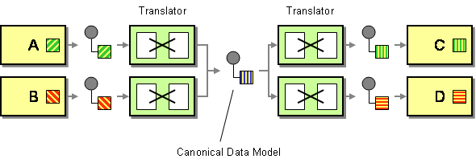

# Document Converter API

An API to convert documents between three different formats

## Architecture

To make an extendable solution. I implemented the solution using the Canonical Data Model (CDM) pattern from the [Enterprise Integration Patterns (EIP)](https://www.enterpriseintegrationpatterns.com/patterns/messaging/CanonicalDataModel.html).



To add new formats, you only need to implement the `FormatAdapter` interface and register it with the `DocumentsService`.

> **Disclaimer:** I made heavily use of AI to work on this project as AI is now part of my day-to-day work. From learning new concepts in a structured way like explaining NestJS to pair-programming solutions, helping me with implementation and testing.

## API

The API has one endpoint `/documents/convert` that accepts a request body with the following fields:

- `file`: the document content in the source format
- `convertFrom`: the source format
- `convertTo`: the target format
- `lineSeparator`: the line separator character
- `elementSeparator`: the element separator character

The response is a raw content depending on the target format.

- `JSON`:
  - Content-Type: application/json
  - Response: a JSON string
- `XML`:
  - Content-Type: application/xml
  - Response: an XML string
- `String`:
  - Content-Type: text/plain
  - Response: a string

### Format #1: String

String data is composed of 'segments' (i.e. lines), each of which is composed of multiple 'elements' (i.e. data values).

Segments/lines are delineated by a line separator character, and elements within a segment are delineated by element separator
characters.

In the example below, the separator characters are ~ and *.

**Example:**

```
ProductID*4*8*15*16*23~
ProductID*a*b*c*d*e~
AddressID*42*108*3*14~
ContactID*59*26~
```

The example above is composed of 4 segments. Each segment is composed of a segment name followed by a number of elements. 

The first two segments have five elements, the third has four, and the fourth has two.

### Format #2: JSON

**Constraints:**

Segments (lines) are nested in arrays and objects where the keys are the segment names followed by an incrementing integer from 1 ... # of elements.

```json
{
  "ProductID": [
    {
      "ProductID1": "4",
      "ProductID2": "8",
      "ProductID3": "15",
      "ProductID4": "16",
      "ProductID5": "23"
    },
    {
      "ProductID1": "a",
      "ProductID2": "b",
      "ProductID3": "c",
      "ProductID4": "d",
      "ProductID5": "e"
    }
  ],
  "AddressID": [
    {
      "AddressID1": "42",
      "AddressID2": "108",
      "AddressID3": "3",
      "AddressID4": "14"
    }
  ],
  "ContactID": [
    {
      "ContactID1": "59",
      "ContactID2": "26"
    }
  ]
}
```

### Format #3: XML

```xml
<?xml version="1.0" encoding="UTF-8"?>
<root>
  <ProductID>
    <ProductID1>4</ProductID1>
    <ProductID2>8</ProductID2>
    <ProductID3>15</ProductID3>
    <ProductID4>16</ProductID4>
    <ProductID5>23</ProductID5>
  </ProductID>
  <ProductID>
    <ProductID1>a</ProductID1>
    <ProductID2>b</ProductID2>
    <ProductID3>c</ProductID3>
    <ProductID4>d</ProductID4>
    <ProductID5>e</ProductID5>
  </ProductID>
  <AddressID>
    <AddressID1>42</AddressID1>
    <AddressID2>108</AddressID2>
    <AddressID3>3</AddressID3>
    <AddressID4>14</AddressID4>
  </AddressID>
  <ContactID>
    <ContactID1>59</ContactID1>
    <ContactID2>26</ContactID2>
  </ContactID>
</root>
```

## Requirements

- Your API should accept a document in any of the above formats and allow the user to specify the format they want to convert it to.
- If the user sends a document in format #1 (string) they will need to specify their separator characters.
- Your solution should:
  - Validate inputs
  - Include a number of tests
  - Work if we run it locally (provide instructions)
  - Demonstrate how you like to structure a production application (file/folder structure)
- You can use libraries to convert between formats #2 and #3 (JSON & XML), but the logic for converting to and from format #1 (string)
  must be completely written by you.
- You will need to demo that your solution works for the example input in format #1 (string) that is attached.

## Project setup

```bash
$ yarn install
```

## Compile and run the project

```bash
# development
$ yarn run start

# watch mode
$ yarn run start:dev

# production mode
$ yarn run start:prod
```

## Run tests

```bash
# unit tests
$ yarn run test

# e2e tests
$ yarn run test:e2e

# test coverage
$ yarn run test:cov
```

## Test the API

The API is available at http://localhost:3000

To test the API, you can use the following cURL commands:

Convert a JSON to string:

```bash
$ curl --location 'http://localhost:3000/documents/convert' \
--form 'file=@"example.json"' \
--form 'convertTo="STRING"' \
--form 'lineSeparator="~"' \
--form 'elementSeparator="*"' \
--form 'convertFrom="JSON"'
```

Convert a JSON to XML:

```bash
$ curl --location 'http://localhost:3000/documents/convert' \
--form 'file=@"example.json"' \
--form 'convertTo="XML"' \
--form 'lineSeparator="~"' \
--form 'elementSeparator="*"' \
--form 'convertFrom="JSON"'
```

Convert a XML to string:

```bash
$ curl --location 'http://localhost:3000/documents/convert' \
--form 'file=@"example.xml"' \
--form 'convertTo="STRING"' \
--form 'lineSeparator="~"' \
--form 'elementSeparator="*"' \
--form 'convertFrom="XML"'
```

Convert a XML to JSON:

```bash
$ curl --location 'http://localhost:3000/documents/convert' \
--form 'file=@"example.xml"' \
--form 'convertTo="JSON"' \
--form 'lineSeparator="~"' \
--form 'elementSeparator="*"' \
--form 'convertFrom="XML"'
```

Convert a string to XML:

```bash
$ curl --location 'http://localhost:3000/documents/convert' \
--form 'file=@"example.txt"' \
--form 'convertTo="XML"' \
--form 'lineSeparator="~"' \
--form 'elementSeparator="*"' \
--form 'convertFrom="STRING"'
```

Convert a string to JSON:

```bash
$ curl --location 'http://localhost:3000/documents/convert' \
--form 'file=@"example.txt"' \
--form 'convertTo="JSON"' \
--form 'lineSeparator="~"' \
--form 'elementSeparator="*"' \
--form 'convertFrom="STRING"'
```

### Test the provided example:

Convert a string to JSON:

```bash
$ curl --location 'http://localhost:3000/documents/convert' \
--form 'file=@"string_test.txt"' \
--form 'convertTo="JSON"' \
--form 'lineSeparator="~"' \
--form 'elementSeparator="*"' \
--form 'convertFrom="STRING"'
```

Convert a string to XML:

```bash
$ curl --location 'http://localhost:3000/documents/convert' \
--form 'file=@"string_test.txt"' \
--form 'convertTo="XML"' \
--form 'lineSeparator="~"' \
--form 'elementSeparator="*"' \
--form 'convertFrom="STRING"'
```
